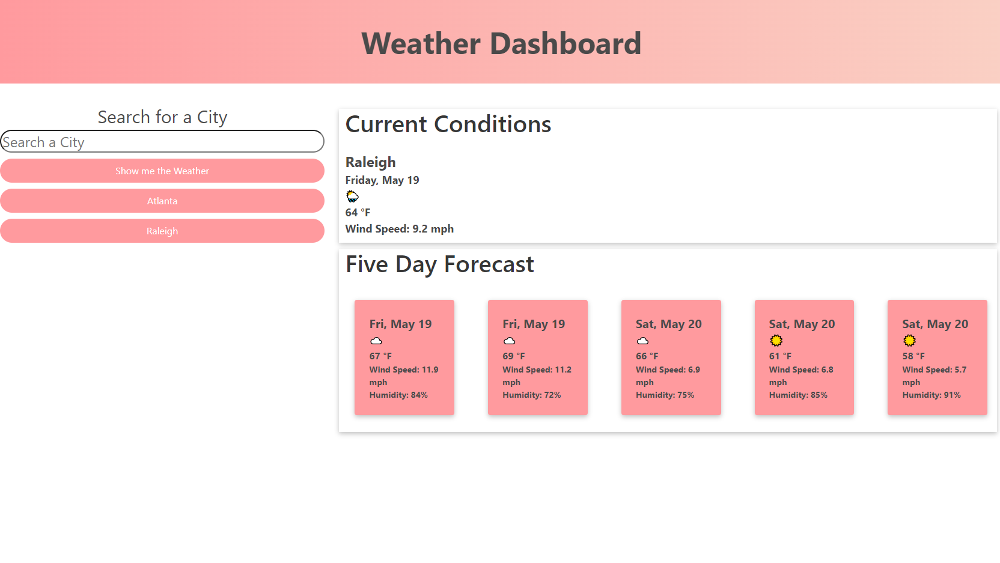

# Weather Dashboard

## 

## User Story
    The purpose of this Acitvity was to create a weather dashboard using an API key and be able to return that data to the user through two different containers. The first being the current weather for a city and the second being a five day forcast. The site meets all the acceptance criteria listed below. It was created with the intention of displaying skills learned in the UNC coding Bootcamp. 
```
AS A traveler
I WANT to see the weather outlook for multiple cities
SO THAT I can plan a trip accordingly
```

## Acceptance Criteria

```
GIVEN a weather dashboard with form inputs
WHEN I search for a city
THEN I am presented with current and future conditions for that city and that city is added to the search history
WHEN I view current weather conditions for that city
THEN I am presented with the city name, the date, an icon representation of weather conditions, the temperature, the humidity, and the wind speed
WHEN I view future weather conditions for that city
THEN I am presented with a 5-day forecast that displays the date, an icon representation of weather conditions, the temperature, the wind speed, and the humidity
WHEN I click on a city in the search history
THEN I am again presented with current and future conditions for that city
```

## Mockup




## Github & Deployment
[Github Repository](https://github.com/A-Witthohn/module-6hw)
[Deployment](https://a-witthohn.github.io/module-6hw)
